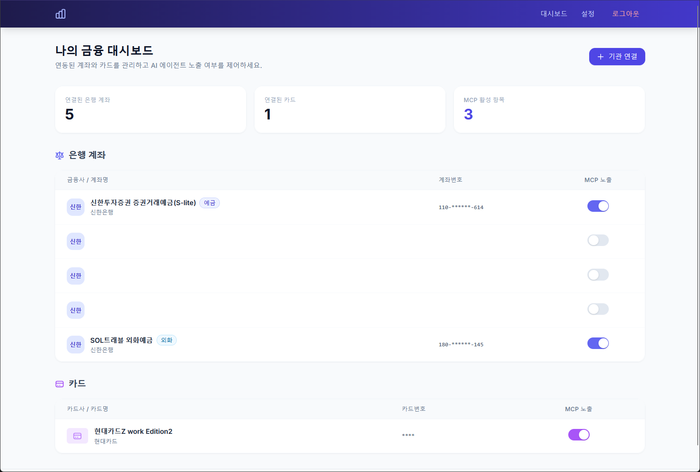
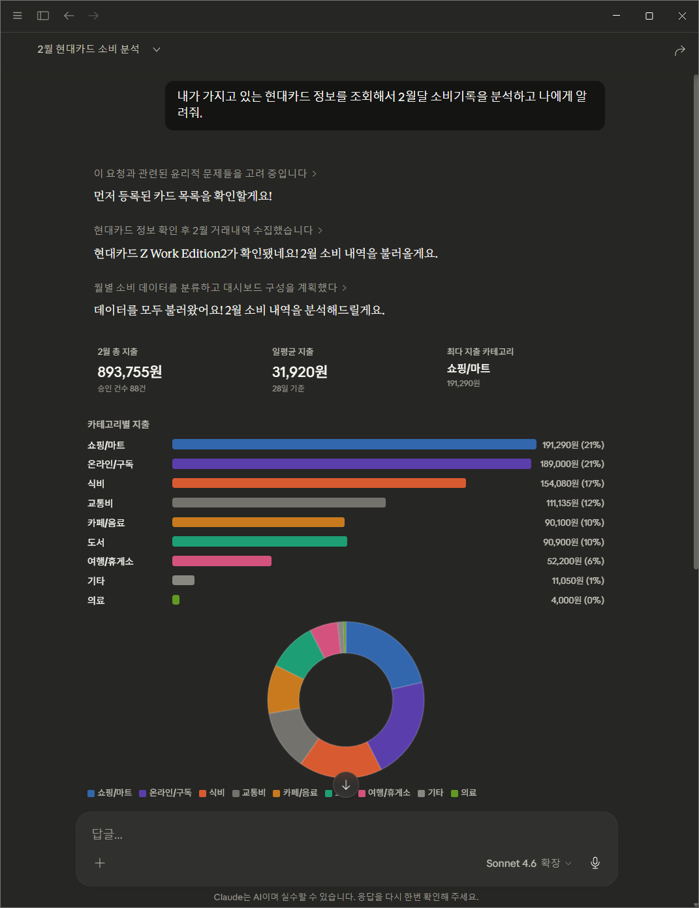
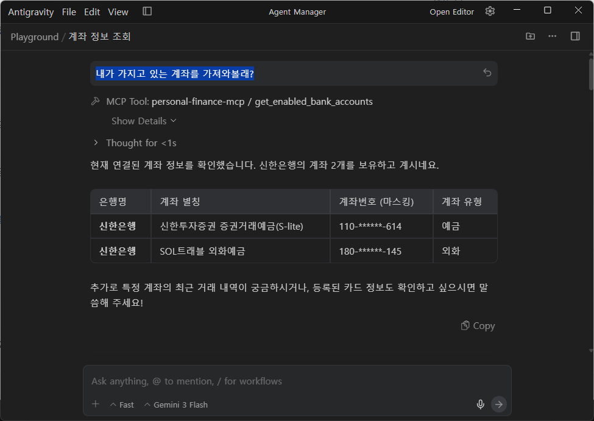

# Personal Finance MCP

개인 자산 정보(마이데이터)를 LLM 모델과 연동하여 세밀한 자산 관리 피드백을 제공하는 프로젝트입니다.<br/>
[MCP(Modal Context Protocol)](https://modelcontextprotocol.io)를 활용하여 LLM 모델은 개인의 자산 정보를 이해하고 사용자 요구사항에 맞춰 최적의 분석 결과를 제공할 수 있도록 합니다.

지금은 다음 기능에 대한 [도구(Tool)](https://modelcontextprotocol.io/docs/learn/server-concepts#tools)를 LLM 모델에게 제공합니다.
* get_enabled_bank_accounts: 사용자가 활성화한 계좌 정보를 LLM 모델에 전달합니다.
* get_bank_transactions: 계좌에 대한 입금, 출금 거래기록을 LLM 모델에 전달합니다.
* get_enabled_card_accounts: 사용자가 활성화한 카드 정보를 LLM 모델에 제공합니다.
* get_card_transactions: 신용/체크 카드에 대한 이용 기록을 LLM 모델에 제공합니다.

<table>
    <tr>
        <th width="50%">Dashboard</th>
        <th width="50%">on Claude Desktop (Claude Sonnet)</th>
    </tr>
    <tr>
        <td></td>
        <td rowspan="3"></td>
    </tr>
    <tr>
         <th>on Antigravity (Gemini 3.0 Flash)</th>
    </tr>
    <tr>
        <td></td>
    </tr>
</table>

## 1. Getting Started 🚀
**Requirements**
* Python 3.14+
* [Codef API](https://codef.io/) Client ID, Client Secret and Public Key 

**Installation**
```bash
# Clone the repository
$ git clone https://github.com/gunyu1019/personal_finance_mcp.git
$ cd personal_finance_mcp

# Create a virtual environment
$ python -m venv venv
$ source venv/bin/activate

# Install dependencies
$ pip install -r requirements.txt

# Setup the configuration file
$ cp config.yaml.example config.yaml
```


**Configuration File**
```dotenv
# .env

# 서버 설정
SERVER_HOST=0.0.0.0
SERVER_PORT=8000

# 애플리케이션 대시보드에 로그인하기 위한 비밀번호입니다.
ROOT_PASSWORD=changeme

# 데이터베이스 연결 URL
DATABASE_URL=sqlite+aiosqlite:///./mydata.db

# CODEF API 연동 정보
CODEF_MODE=demo  # sandbox, demo or live
CODEF_CLIENT_ID=your_codef_client_id
CODEF_CLIENT_SECRET=your_codef_client_secret
CODEF_PUBLIC_KEY=your_codef_public_key

# 보안 설정 관련 상수 키입니다.
# 그대로 냅두시면 됩니다.
ADMIN_COOKIE_NAME=admin_session
TOKEN_EXPIRE_HOURS=12
JWT_ALGORITHM=HS256
JWT_SUBJECT=admin
SSE_RETRY_TIMEOUT=15000

# 민감 정보를 보호가 위한 AES-256 대칭키 암호화 키입니다.
# 서버 첫 실행 시 로그에 출력되는 Fernet 키 문자열을 그대로 넣으세요.
ENCRYPTION_SECRET_KEY=
```

**Run**
> 현재 `ahttp_client` 패키지의 `pydantic_response_model` 함수 문제로 인해 `service.codef` 모듈이 정상적으로 작동하지 않습니다. 빠른 시일 내에 조치될 예정입니다.
```bash
$ python -m uvicorn app.main:app --reload 
```