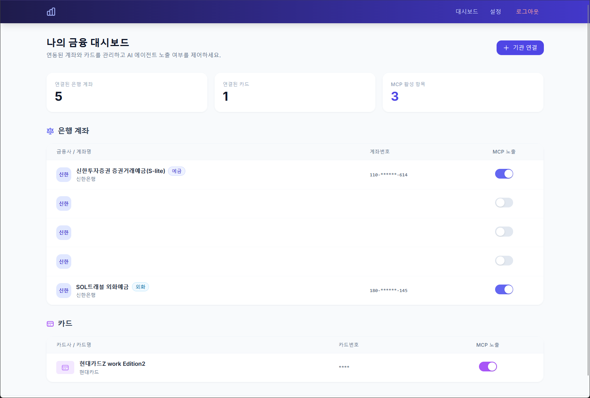
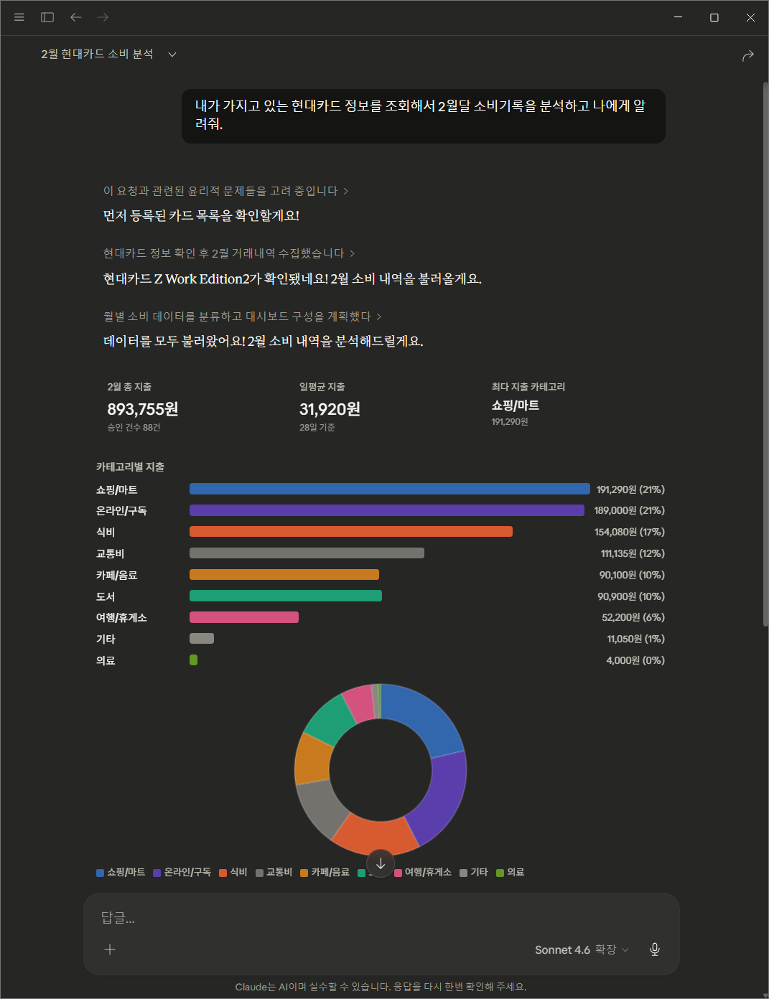
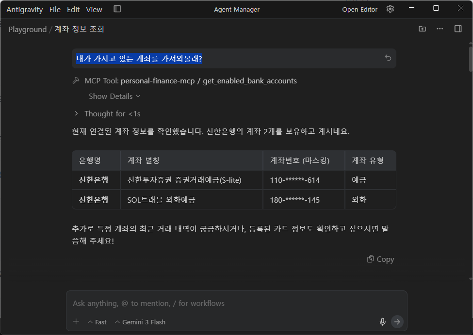
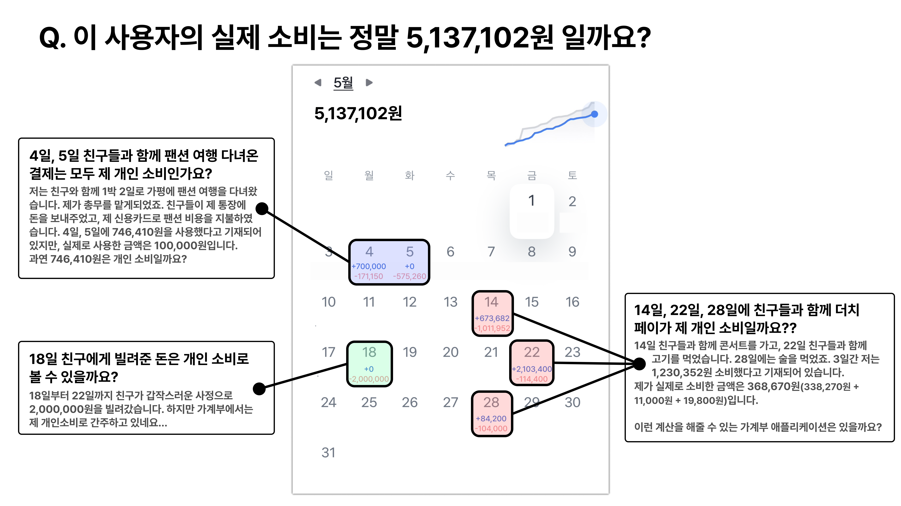
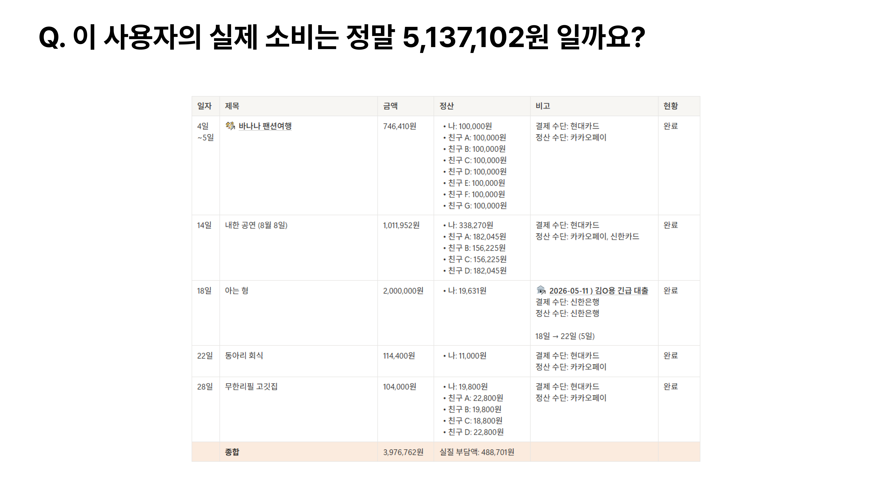
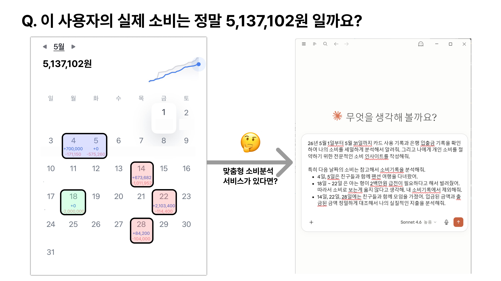
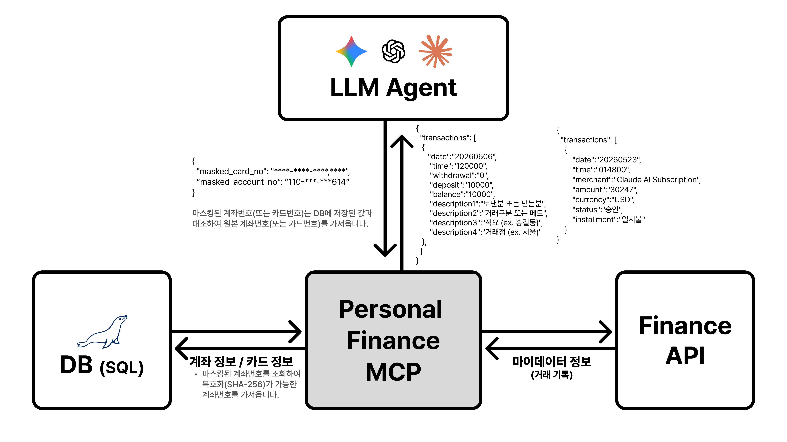

# Personal Finance MCP

개인 자산 정보(마이데이터)를 LLM 모델과 연동하여 세밀한 자산 관리 피드백을 제공하는 프로젝트입니다.<br/>
[MCP(Model Context Protocol)](https://modelcontextprotocol.io)를 활용하여 LLM 모델은 개인의 자산 정보를 이해하고 사용자 요구사항에 맞춰 최적의 분석 결과를 제공할 수 있도록 합니다.

지금은 다음 기능에 대한 [도구(Tool)](https://modelcontextprotocol.io/docs/learn/server-concepts#tools)를 LLM 모델에게 제공합니다.
* get_enabled_bank_accounts: 사용자가 활성화한 계좌 정보를 LLM 모델에 전달합니다.
* get_bank_transactions: 계좌에 대한 입금, 출금 거래기록을 LLM 모델에 전달합니다.
* get_enabled_card_accounts: 사용자가 활성화한 카드 정보를 LLM 모델에 제공합니다.
* get_card_transactions: 신용/체크 카드에 대한 이용 기록을 LLM 모델에 제공합니다.

<table>
    <tr>
        <th width="50%">Dashboard</th>
        <th width="50%">on Claude Desktop (Claude Sonnet)</th>
    </tr>
    <tr>
        <td></td>
        <td rowspan="3"></td>
    </tr>
    <tr>
         <th>on Antigravity (Gemini 3.0 Flash)</th>
    </tr>
    <tr>
        <td></td>
    </tr>
</table>

## 1. Motivation 🎯

저는 올해 자취를 시작하게 된 대학생입니다. 매달 소비기록을 훑어보며 효율적인 소비를 위해 가계부를 작성하곤 합니다.
아래 사진은 [마이데이터](https://www.mydatacenter.or.kr:3441/myd/index/index.do)를 이용한 T사 프로그램을 이용하여 확인한 소비 기록입니다.
하지만 날짜별 소비기록을 훑어보았을 때, 이 사용자가 정말 5,137,102원을 5월에 사용했는지 의문을 갖기 시작했습니다.



4일, 5일에는 친구들과 함께 팬션 여행을 떠났고, 14일, 22일, 28일에는 모임을 가졌습니다. 
18일에는 친한 형이 어쩔 수 없는 이유로 급전을 빌려갔네요. 

저는 결제 기록을 순수하게 제 개인 소비로 취급해도 되는건가?라는 의문을 갖게 되었습니다.



특히 저는 Notion 플랫폼을 통해 다음과 같이 모든 지출, 
수입을 모두 기록하고 있으며 체계적인 기록을 통해 더치 페이, 여행 비용 등 다양한 형태의 지출을 관리하고 있습니다.

하지만 사람은 계산하는 과정에서 실수도 할 수 있으며, 매번 모든 지출을 일일이 기록하는 것도 상당히 번거로운 일입니다.
실질적으로 한 달에 30~40건의 모임 지출이 발생하며, 하나하나 기록하는 것은 시간적 손해가 매우 큽니다. 



따라서 "LLM이 저의 특수한 소비 패턴을 정밀하게 분석하고, 환경을 고려한 맞춤형 가계부를 제공해주면 어떨까?"라는 발상에서 Personal Finance MCP 프로젝트를 시작하게 되었습니다.

이 프로젝트는 개인 금융 자산(소비 기록과 자산 현황)을 MCP(Model Context Protocol)의 도구로 LLM 모델에게 제공하며, 맞춤형 소비 분석을 할 수 있도록 도움을 줍니다.

## 2. MCP Architecture 🏗️
<ul>
    <li><b>get_enabled_bank_accounts, get_enabled_card_accounts</b>: LLM Agent가 MCP를 통해 기능을 호출하면, Personal Finacne MCP는 
Finance API(마이데이터) API에 호출하여 사용자와 연결된 계좌번호(또는 카드번호)를 확인합니다. 새롭게 조회되는 금융 정보가 있다면 암호화 과정을 거친 다음 데이터를 최소화하여 DB에 저장합니다.

DB에 저장을 마치면 전처리를 진행한 다음에 LLM Agent에 제공합니다. 이때 제공되는 계좌 번호(또는 카드 번호)는 홈페이지(대시보드)에서 활성화된 계좌 번호(또는 카드 번호)만 전달되며 비활성화한 계좌번호(또는 카드번호)는 일체 제공되지 않습니다. 
또한 계좌번호도 원문을 제공하는 것이 아닌 마스킹 처리를 거친 번호만 LLM Agent에게 전달됩니다. 
<br/>
        
    </li>
    <li><b>get_bank_transactions, get_card_transactions</b>: 마스킹된 계좌번호 또는 카드번호를 LLM Agent가 MCP를 통해 제공하면,
Personal Finacne MCP는 DB에 저장된 마스킹 계좌번호와 대조하여, SHA-256 기반의 복호화가 가능한 계좌번호를 가져옵니다.
이를 복호화하여 Finance API(마이데이터 API)에 제공하며, 거래 기록을 받고 MCP에 올바르게 전처리를 진행한 다음에 LLM Agent에 다시 제공합니다. 
<br/>
        
    </li>
</ul>
## 3. Getting Started 🚀
**Requirements**
* Python 3.14+
* [Codef API](https://codef.io/) Client ID, Client Secret and Public Key 

**Installation**
```bash
# Clone the repository
$ git clone https://github.com/gunyu1019/personal_finance_mcp.git
$ cd personal_finance_mcp

# Create a virtual environment
$ python -m venv venv
$ source venv/bin/activate

# Install dependencies
$ pip install -r requirements.txt

# Setup the configuration file
$ cp .env.example .env
```


**Configuration File**
```dotenv
# .env

# 서버 설정
SERVER_HOST=0.0.0.0
SERVER_PORT=8000

# 애플리케이션 대시보드에 로그인하기 위한 비밀번호입니다.
ROOT_PASSWORD=changeme

# 데이터베이스 연결 URL
DATABASE_URL=sqlite+aiosqlite:///./mydata.db

# CODEF API 연동 정보
CODEF_MODE=demo  # sandbox, demo or live
CODEF_CLIENT_ID=your_codef_client_id
CODEF_CLIENT_SECRET=your_codef_client_secret
CODEF_PUBLIC_KEY=your_codef_public_key

# 보안 설정 관련 상수 키입니다.
# 그대로 냅두시면 됩니다.
ADMIN_COOKIE_NAME=admin_session
TOKEN_EXPIRE_HOURS=12
JWT_ALGORITHM=HS256
JWT_SUBJECT=admin
SSE_RETRY_TIMEOUT=15000

# 민감 정보를 보호가 위한 AES-256 대칭키 암호화 키입니다.
# 서버 첫 실행 시 로그에 출력되는 Fernet 키 문자열을 그대로 넣으세요.
ENCRYPTION_SECRET_KEY=
```

**Run**
```bash
$ python -m uvicorn app.main:app --reload 
```

## 4. Use Cases 💡

## 5. Project Structure 📁

```
personal_finance_mcp/
├── app/
│   ├── api/                    # FastAPI 라우터 (REST API 엔드포인트)
│   │   ├── auth.py             # 관리자 인증 (JWT)
│   │   ├── finance.py          # 계좌/카드 동기화 API
│   │   ├── crypto.py           # RSA 공개키 관리
│   │   └── page.py             # 대시보드 페이지 렌더링
│   ├── core/                   # 핵심 설정 및 유틸리티
│   │   ├── config.py           # 환경 변수 관리 (Pydantic Settings)
│   │   ├── database.py         # SQLAlchemy 비동기 세션
│   │   ├── security.py         # RSA/AES-256 암호화 유틸리티
│   │   └── import_supporter.py # api/model/mcp 동적 모듈 로딩
│   ├── mcp/                    # MCP Tool 정의 (LLM에 노출되는 도구)
│   │   ├── bank_tool.py        # 은행 계좌/거래내역 Tool
│   │   └── card_tool.py        # 카드/승인내역 Tool
│   ├── model/                  # SQLAlchemy ORM 모델
│   ├── repository/             # 데이터 접근 계층 (Repository 패턴)
│   ├── schema/                 # Pydantic 요청/응답 스키마
│   ├── dto/                    # 계층 간 데이터 전송 객체
│   ├── service/
│   │   └── codef/              # CODEF API 클라이언트 (마이데이터 조회)
│   │       ├── auth/           # 인증 API
│   │       ├── bank/           # 은행 조회 API
│   │       └── card/           # 카드 조회 API
│   ├── template/               # Jinja2 HTML 템플릿 (대시보드 UI)
│   └── main.py                 # 애플리케이션 진입점
├── .env.example                # 환경 변수 예시
├── mapping.ini                 # 금융사 코드 매핑 설정
└── requirements.txt            # Python 의존성 목록
```

## 6. Disclaimer ⚠️
* **비전문적 조언:** <br/>
  본 프로젝트와 연동된 LLM이 제공하는 자산 분석, 가계부 작성, 재무 관련 답변은 **__참고용__**일 뿐이며, 전문적인 재무 상담이나 투자 권유를 대체할 수 없습니다.


* **AI 환각(Hallucination) 주의:** <br/>
  생성형 AI의 특성상 부정확하거나 지어낸 정보를 제공할 수 있습니다. 
  실제 금전적인 의사결정이나 중요한 거래 전에는 반드시 실제 금융사의 공식 데이터를 직접 교차 검증하시기 바랍니다.
 
* **보안 주의:** <br/>
  본 프로젝트는 입력된 금융 데이터는 LLM 제공자의 서버로 전송되므로,
  민감한 개인 금융 정보가 외부에 노출될 수 있습니다. 반드시 **신뢰할 수 있는 개인 환경**에서만 사용하시기 바랍니다.

* **면책 조항:** <br/>
  본 프로젝트를 사용하면서 발생하는 데이터 유출(환경 변수 유출, 사용자 기기 보안 취약점 등) 및 LLM의 답변으로 인한 직/간접적 손실에 대한 모든 책임은 사용자 본인에게 있으며, 프로젝트 개발자 및 기여자는 어떠한 법적 책임도 지지 않습니다. 
  또한 소프트웨어를 사용하여 데이터를 수집하는 과정에서 **특정 금융사 또는 API 제공자의 이용약관(스크래핑 금지 조항, 과도한 트래픽 유발 등)을 위반하여 발생하는 계정 잠금, 서비스 이용 정지, 법적 분쟁** 등에 대해 프로젝트 개발자는 일절 책임을 지지 않습니다.

## 7. License 📄
This project is licensed under the [BSD 3-Clause License](LICENSE) - see the LICENSE file for details.